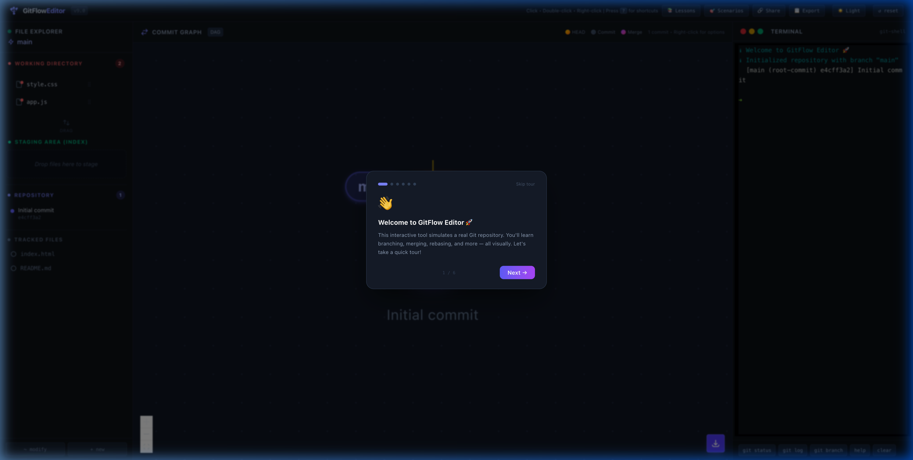
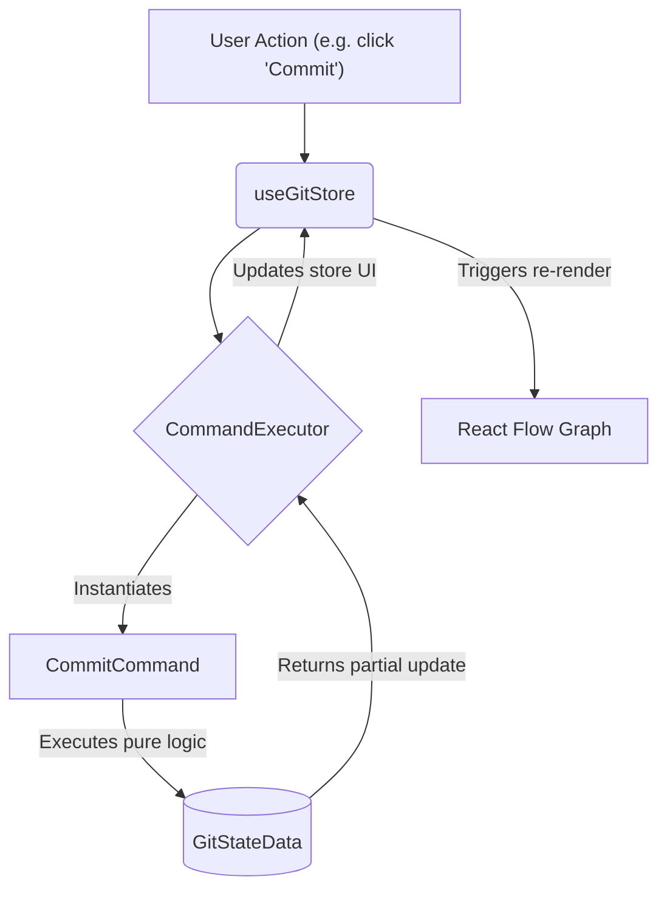
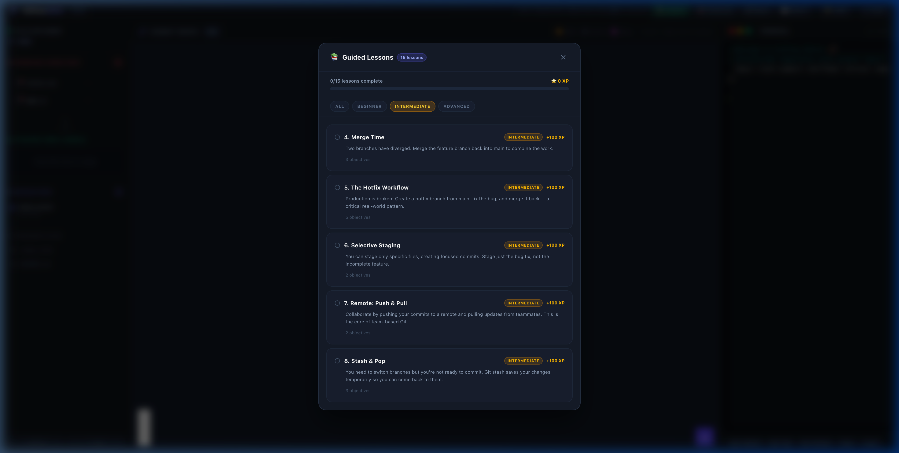
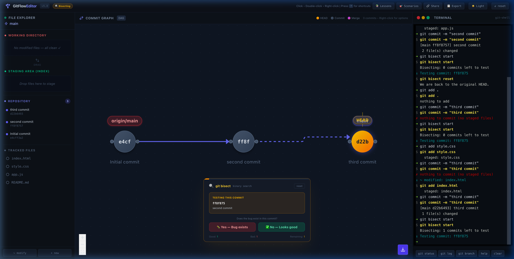
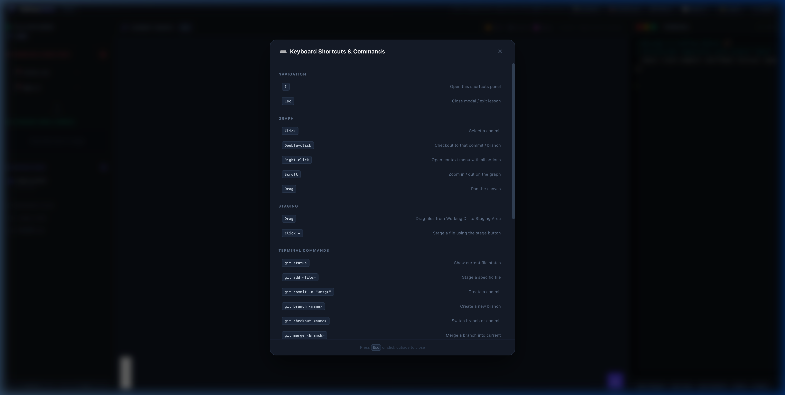

# 🌳 GitFlow Editor v9.0

**GitFlow Editor** is a powerful, interactive Git simulation and educational tool designed to help developers master Git workflows visually. Instead of just reading about branches and merges, users can manipulate a live DAG (Directed Acyclic Graph) and see exactly how Git works under the hood.



## 🚀 Key Features

### 🎓 Guided Lesson Engine
- **15 Interactive Lessons**: Ranging from "First Commit" to "Advanced Git Bisect".
- **Real-time Evaluation**: Objectives update instantly as you perform actions.
- **XP & Gamification**: Earn XP as you complete challenges and level up your Git skills.
- **Persistence**: Your progress is automatically saved to local storage.

### 🌳 Visual Git Graph
- **Interactive DAG**: Click nodes to inspect commits, double-click to checkout branches.
- **Rich Context Menus**: Perform complex operations like Rebase, Merge, Cherry-pick, and Reset directly from the graph.
- **Export to Image**: Download your visual Git history as a PNG.

### 💻 Integrated Terminal
- **Real Git Commands**: Supports `git commit`, `git merge`, `git rebase`, `git stash`, `git checkout`, and many more.
- **Auto-completion & History**: A developer-friendly terminal experience.
- **Quick Command Buttons**: One-click access to common Git operations.

### 🔍 Advanced Tooling
- **Git Bisect Simulation**: Interactive binary search to find problematic commits.
- **Interactive Rebase**: Visual interface to squash, edit, and reorder commits.
- **Branch Comparison**: Side-by-side diff view of two different branches.
- **Conflict Resolver**: Visual modal to resolve simulated merge conflicts.

## 📖 How to Use

*(See our [Contribution Guide](CONTRIBUTING.md) for local setup, or read the [Git Engine Architecture Docs](docs/git-engine.md) to understand how it works under the hood).*

GitFlow Editor is divided into three main interactive panes:

### 1. File Explorer (Left)
- **Modify Files**: Click the `~ modify` or `+ new` buttons at the bottom to simulate local changes.
- **Stage Changes**: Click the `+ Stage` button next to a modified file or drag it into the **Staging Area** to prepare it for a commit.

### 2. Commit Graph (Center)
- **Select Commit**: Click any node to view its details in the **Commit Inspector**.
- **Checkout**: Double-click a commit node or branch label to switch your `HEAD` to that position.
- **Actions**: Right-click any node to open a context menu for advanced operations:
    - **Merge/Rebase**: Integrate branches.
    - **Reset**: Move a branch pointer back in time (`--soft`, `--mixed`, or `--hard`).
    - **Cherry-pick / Revert**: Apply or undo specific commits.
- **Navigation**: Use your mouse wheel to zoom and click-drag the canvas to pan.

### 3. Integrated Terminal (Right)
- **Commands**: Type standard Git commands (e.g., `git commit -m "feat: login"`) and press **Enter**.
- **Shortcuts**: Use the quick-action buttons at the bottom for common commands like `git status`, `git log`, and `help`.

### 🎓 Learning & Scenarios
- **Lessons**: Click the **📚 Lessons** button in the header to start a guided challenge. Follow the objectives at the top of the screen.
- **Scenarios**: Click **🎯 Scenarios** to load pre-built complex repository states for practice.
- **Help**: Press **`?`** anywhere to view the full keyboard shortcuts and command reference.

## 🛠️ Tech Stack

- **Framework**: [React 18](https://reactjs.org/) + [TypeScript](https://www.typescriptlang.org/)
- **Build Tool**: [Vite](https://vitejs.dev/)
- **Graph Visualization**: [@xyflow/react (React Flow)](https://reactflow.dev/)
- **State Management**: [Zustand](https://github.com/pmndrs/zustand)
- **Styling**: [Tailwind CSS](https://tailwindcss.com/)

### 🧠 Core Architecture (Phase 10+)

The Git logic is entirely decoupled from the view layer using a **Command Pattern Engine**.



- **Persistence**: Zustand Persist (Local Storage)
- **Animations**: [Framer Motion](https://www.framer.com/motion/)

## 📦 Getting Started

### Prerequisites
- Node.js (v18+)
- npm or yarn

### Installation
```bash
# Clone the repository
git clone <repository-url>

# Install dependencies
npm install
```

### Development
```bash
# Start the dev server
npm run dev
```

### Build
```bash
# Create a production build
npm run build
```

---

## 📸 Screenshots

### Advanced Lesson Picker


### Git Bisect Interface


### Keyboard Shortcuts


